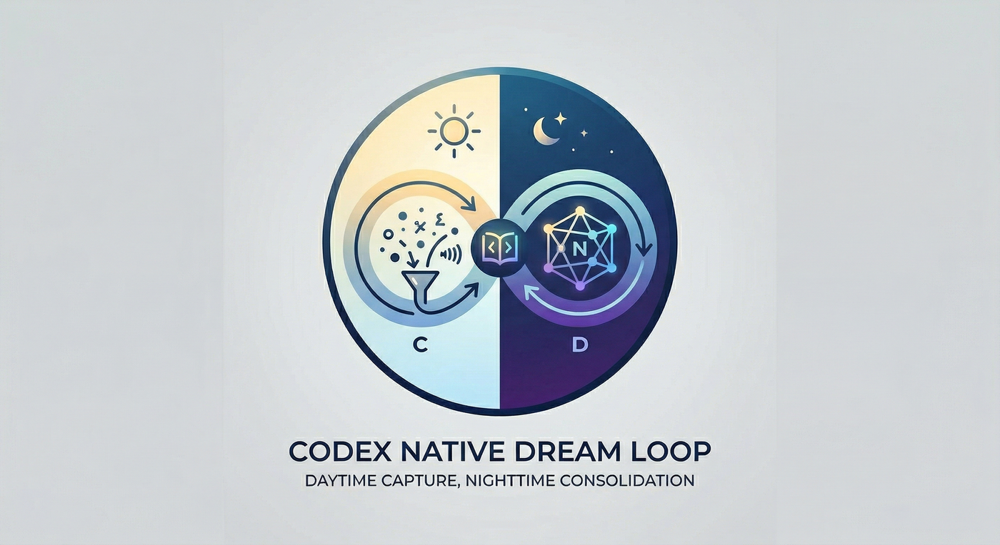

# Codex Native Dream Loop

[English](README.md) | 中文



**一个面向 Codex 的自我进化闭环：对外只保留两个主层，`ACTIVE.md` 负责当前热规则与热路径，`LEARNINGS.md` 负责可复用的获胜路径。**

`Codex Native Dream Loop` 适合这样的人：希望 Codex 越做越强，但不想把记忆系统越堆越复杂。目标不是暴露更多层，而是让 Codex 下一次更快复用已经赢过的路线。

## 为什么存在

很多 agent 不是不会做事，而是：

- 反复从零开始
- 有用经验散在旧对话里
- 临时规则留得太久
- plugin 和 skill 找得太晚
- 记忆层越加越多，却没有更清楚

这个仓库就是为了让下一次行动比上一次更省、更快、更稳。

## 公开模型

对外只保留两层：

- `ACTIVE.md`
  - 当前立刻影响行为的热规则和热路径
- `LEARNINGS.md`
  - 已验证、可跨任务复用的路径记忆

## 闭环怎么工作

工作循环是：

`recall -> choose -> search if needed -> execute -> land or quarantine -> consolidate`

落到实际步骤就是：

1. 先从 `ACTIVE.md` 和 `LEARNINGS.md` 里只取最小相关片段。
2. 如果已有路线明显适用，就先复用。
3. 如果把握还不够高，再让 `capability-evolution` 按顺序搜索：
   已启用官方插件 -> 可安装官方插件 -> 本地 skills -> 可信 GitHub 项目。
4. 当前任务只选一条获胜路线执行，不把多条竞争路线同时固化。
5. 用 `capture-memory` 直接把明确强信号落到 `ACTIVE.md` 或 `LEARNINGS.md`；只有推断型、未验证信号才进 `inbox/`。
6. 用 `dream-consolidate` 在维护时刷新热层、强化路径记忆、清空未决信号，并把淘汰路线归档。

## 核心 Skills

这套系统主要由三个 skill 组成：

- `capture-memory`
  - 明确强信号直接落层；推断型未验证信号短暂隔离
- `capability-evolution`
  - 路线发现、能力验证、能力选择
- `dream-consolidate`
  - 维护 `ACTIVE.md`、强化 `LEARNINGS.md`、处理剩余 inbox、记录审计

它们共同服务一个目标：

**先复用已经赢过的路线，不够时再扩大搜索。**

## 自动化

这套系统默认只需要一个 recurring automation，而不是越拆越多的定时 agent。

这个 automation 每次运行要同时完成四件事：

- 维护双层 memory
- 审计当前 repo / PR 轮次
- 检查 automation 自己的 prompt 有没有落后
- 给出下一轮最小可执行改进建议

它在 repo 层只做审计和建议，不静默修改跟踪文件。

## 后台机制

系统仍然保留一些后台机制，但它们不再是主要心智模型：

- `inbox/`
  - 只用于推断型、未验证、仍有冲突的短期隔离信号
- `AUDIT_LOG.md`
  - 最小化的晋升、拒绝、归档、回滚痕迹
- `ARCHIVE/`
  - 退役或被替代的内容，用于保留可追溯性

`inbox/` 不是第三个公开记忆层。明确强信号不应该长期停在里面。

## 快速开始

如果你想图省事，最简单的方式就是把这个仓库交给 Codex，让它帮你接到自己的 Codex home 里。

例如：

```text
Install the skills from https://github.com/JY0xLU/codex-native-dream-loop and wire them into my Codex setup.
```

如果你想手动安装：

1. 把 `skills/capture-memory/`、`skills/capability-evolution/` 和 `skills/dream-consolidate/` 复制到 `$CODEX_HOME/skills/` 或 `~/.codex/skills/`。
2. 把 `templates/global/` 复制到你的 Codex home 作为起始结构。
3. 把 `AGENTS.md` 片段接入你的全局入口或项目入口。
4. 日常优先读 `ACTIVE.md`，其次才读 `LEARNINGS.md`。
5. 需要找更优路线时，用 `capability-evolution` 扩大搜索。
6. 用 `capture-memory` 直接落明确强信号；只把未决信号放进 `inbox/`。
7. 运行这一个 Dream Loop automation，在维护时刷新热层、处理未决信号、审计 repo/PR，并给出下一轮建议。

## 什么叫效果变好了

这套系统真正跑顺之后，会有这些变化：

- 新任务不再频繁从零开始
- `ACTIVE.md` 会一直很短，而且一眼能看出现在为什么重要
- `LEARNINGS.md` 更像路径库，不像心得堆
- 明确纠正和稳定偏好会很快落层，而不是在 `inbox/` 里拖着
- plugin 和 skill 会在需要时被主动找出来
- 失败或淘汰路线会被归档，而不是静默消失
- 系统更快了，但没有变得更乱
